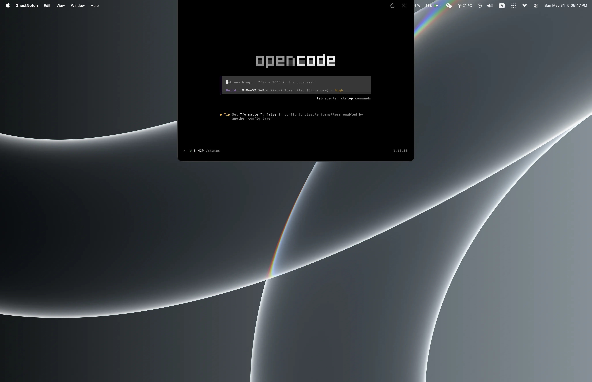

# GhostNotch MVP Specification

> Historical MVP implementation plan. The baseline described here is now implemented; current public docs live in [`../README.md`](../README.md).

## Current Implementation Baseline

GhostNotch is a native macOS Dynamic-Island-style terminal utility. The current codebase has completed the Stage 1 floating island shell, notch geometry work, a native PTY-backed terminal session module, and Ghostty-backed grid terminal rendering. The expanded island now starts a real default-shell session on first open, renders PTY output through a vendored `libghostty-vt` artifact, accepts keyboard input and paste, resizes the PTY from the terminal surface, and preserves the session while collapsed. It should be treated as a Ghostty-backed notch terminal surface, not a full Ghostty-equivalent renderer or shell environment yet.

The canonical project is the root Xcode project:

```text
GhostNotch.xcodeproj
```

That project builds source files from:

```text
GhostNotch/
├── AppDelegate.swift
├── GhostNotchApp.swift
├── Terminal/
├── Window/
└── UI/
```

The duplicate project/source copy has been removed. Future implementation work should use the root project and root `GhostNotch/` source tree.

## Product Goal

Build a tiny floating terminal island for macOS that:


- Sits visually at the MacBook notch.
- Extends subtly beyond the physical notch so users can tell the app is active.
- Expands on hover for a preview state.
- Expands on click into a compact terminal panel with keyboard focus.
- Keeps one terminal session alive while collapsed.
- Uses Ghostty's VT engine through a vendored `libghostty-vt` artifact while GhostNotch owns the AppKit renderer, PTY lifecycle, and notch UI.
- Feels like a notch-native utility, not a normal terminal window.

The MVP should prioritize a reliable native shell, fast interaction, polished notch integration, and the Ghostty parity work that most affects daily terminal use: rendering fidelity and shell integration.

## Completed Scope

The current implementation already includes:

- Native Swift macOS app shell.
- AppKit lifecycle through `AppDelegate`.
- Menu bar item with `>_` label.
- Floating borderless `NSPanel` implementation.
- Non-activating collapsed and hover states.
- Key-focus accepting expanded state.
- Top-flush notch-extension geometry.
- Collapsed, hover, and expanded visual states.
- Hover-driven preview expansion.
- Click-to-expand behavior.
- Escape forwarding when terminal grid is focused, with non-terminal Escape collapse fallback.
- Local and global outside-click collapse.
- Status-bar-level panel placement.
- All-Spaces/full-screen auxiliary collection behavior.
- Expanded terminal UI backed by the real PTY session.
- First-open terminal session lifecycle owned by the panel/controller layer.
- Ghostty-backed grid VT output rendering in the expanded island.
- ANSI color/style, cursor movement, cursor visual style, clear-screen, alternate-screen, resize, focus/blur encoding, paste encoding, Ghostty-backed key encoding, scrollback viewport movement, grapheme-aware cell snapshots, wide-cell spacer metadata, and device-query write-back coverage in the terminal core tests.
- Keyboard input routing for text, Ghostty-encoded special keys/modifiers, Escape forwarding when the terminal grid is focused, and paste.
- Primary-screen scrollback via `libghostty-vt` viewport APIs.
- App-level terminal text selection and copy from the grid surface.
- PTY resize propagation from the expanded terminal surface.
- Runtime notch measurement for notch displays, with a stable synthetic fallback on non-notch displays.
- Native `Terminal/` module with shell resolution and PTY session lifecycle.
- `GhostNotchTests` target covering shell resolution, real PTY command output, session stopping, and input mapping.
- Product toggle hotkey (`Option+Space`) for expand/collapse.
- Header sits flush at top of expanded panel (38pt spacer removed).
- Enlarged close button with 14pt icon and 12/6 padding for easier clicking.
- Pinned Ghostty VT vendor boundary under `vendor/ghostty-vt/`, including `GhosttyVT.xcframework`, copied public headers, source/version metadata, and a reproducible build script.
- C bridge layer that isolates unstable `libghostty-vt` symbols from Swift app code.

The current expanded island terminal is intentionally a lean Ghostty-backed rendering path. `GhosttyTerminalCore` now calls a GhostNotch-owned C bridge over `libghostty-vt` for VT parsing, terminal state, render snapshots, paste/focus encoding, and PTY write-back callbacks. SwiftUI still does not own terminal lifecycle; the panel/controller layer owns the persistent PTY session and renderer.

Current Ghostty parity limits:

- GhostNotch uses Ghostty's VT state and key/paste/focus encoders, but not Ghostty's full renderer stack.
- The current render model preserves Ghostty grapheme clusters and wide-cell spacer metadata, and the AppKit grid uses a CoreText-backed drawing path. It still does not claim full Ghostty renderer parity for ligatures, font features, fallback-font choices, metrics, or presentation behavior.
- Kitty graphics/images, synchronized rendering presentation polish, hyperlinks, semantic selection, and richer clipboard/control-sequence UX are not surfaced yet.
- The launched shell still uses a conservative `TERM=xterm-256color` environment rather than a Ghostty-style `xterm-ghostty` terminfo setup.
- GhostNotch now sets terminal identity and truecolor metadata, exposes an opt-in shell integration resource directory, and captures OSC 7 working-directory reports. SSH behavior and full shell acceptance remain conservative follow-ups.

## Current Implemented Architecture

```text
GhostNotch/
├── GhostNotchApp.swift
├── AppDelegate.swift
│
├── Terminal/
│   ├── ShellResolver.swift
│   ├── PTYProcess.swift
│   ├── TerminalSession.swift
│   ├── TerminalSessionState.swift
│   ├── TerminalRenderingEngine.swift
│   ├── TerminalRenderModel.swift
│   ├── TerminalSurfaceCoordinator.swift
│   ├── GhosttyTerminalCore.swift
│   ├── GhosttyTerminalEngine.swift
│   ├── GhosttyVTBridge.h
│   └── GhosttyVTBridge.c
│
├── Window/
│   ├── IslandPanel.swift
│   ├── IslandPanelController.swift
│   ├── WindowPositioner.swift
│   └── OutsideClickMonitor.swift
│
└── UI/
    ├── IslandRootView.swift
    ├── IslandIndicatorView.swift
    ├── IslandExpandedView.swift
    ├── TerminalGridSurfaceView.swift
    ├── TerminalGridView.swift
    ├── TerminalCellGlyphRenderer.swift
    ├── TerminalTextDecorationRenderer.swift
    ├── TerminalPixelGrid.swift
    ├── TerminalGridTypography.swift
    └── TerminalKeyEvent+AppKit.swift
```

### App Shell

`AppDelegate` is responsible for:

- Setting `NSApp` activation policy to `.regular`.
- Creating the menu bar item.
- Showing the island panel on launch.
- Expanding the island from the menu item.
- Installing the temporary notch color debug hotkey.
- Cleaning up the hotkey and panel on termination.

### Window System

`IslandPanel` subclasses `NSPanel` and controls key eligibility through `shouldAcceptKeyFocus`.

Current focus behavior:

- Collapsed and hover states use `.nonactivatingPanel`.
- Expanded state removes `.nonactivatingPanel`, activates the app, and makes the panel key.
- Escape is routed to the focused terminal grid; if the terminal grid is not focused, `IslandPanel.keyDown` can still route Escape to collapse.

`IslandPanelController` owns:

- `state: IslandState`
- `notchFillMode: NotchFillMode`
- One long-lived `TerminalSession`
- Terminal focus request state
- Panel creation and configuration.
- Expand/collapse transitions.
- Hover state transitions.
- Outside-click monitor lifecycle.
- First-open terminal startup.
- Terminal input and resize forwarding.

Current panel configuration:

```text
isOpaque: false
backgroundColor: clear
hasShadow: false
level: statusBar
hidesOnDeactivate: false
isMovable: false
collectionBehavior: canJoinAllSpaces, fullScreenAuxiliary, stationary
animationBehavior: none
```

### Positioning

`WindowPositioner` currently centers the island horizontally on the main screen and pins it flush to the top of the screen:

```swift
x = screenFrame.midX - size.width / 2
y = screenFrame.maxY - size.height
```

This intentionally differs from an ordinary floating capsule below the menu bar. The visual should read as a hardware notch extension.

Current metrics:

```text
physicalNotchReferenceWidth: 220 pt
collapsedSize: 280 x 38 pt
hoverSize: 420 x 72 pt
expandedSize: 680 x 320 pt
```

The 220 pt reference comes from local notch research in `docs/notch-geometry.md`.

### UI System

`IslandRootView` renders a custom top-flush `NotchExtensionShape` with only the lower corners rounded.

Current shape behavior:

- Top edge is flat.
- Top edge is flush with the screen top.
- Bottom corners are rounded.
- Collapsed and hover radius: 14 pt.
- Expanded radius: 18 pt.
- Hover and expanded states draw a subtle 2 px white translucent rim.
- The rim follows only the side and bottom edges; the top edge stays unoutlined so the island remains visually fused with the physical notch.
- Expanded separation comes from the rim, not a drop shadow, to avoid rectangular backing artifacts around the rounded corners.
- Foreground content is clipped to the same notch shape so expanded terminal content cannot square off the rounded bottom corners.

`NotchFillMode` currently supports:

- `.black`
- `.darkGray`

This is a Stage 1 debug aid for visually comparing the software fill against the real hardware notch. It should not be treated as an end-user MVP setting yet.

`IslandIndicatorView` keeps the center hardware-notch region visually clear in collapsed state and places active indicators in the side extensions:

- Left extension: Ghostty-style mark.
- Center gap: physical notch reference width.
- Right extension: green status dot.

Hover state shows:

- `default shell ready`
- green active dot
- `>_`
- `ready`

`IslandExpandedView` currently renders:

- Header row with status dot, "GhostNotch" title, shell status, and close button — flush at top of panel.
- Real terminal status.
- AppKit-backed terminal grid surface.
- Close button (14pt xmark icon, 12/6 padding).

The embedded terminal surface currently:

- Displays a `TerminalRenderSnapshot` produced by the rendering engine from PTY output bytes.
- Shows startup and error states.
- Accepts ordinary text input.
- Encodes special keys, modifiers, and Escape through `libghostty-vt`.
- Supports paste from the system pasteboard.
- Supports primary-screen scrollback using Ghostty viewport state.
- Supports app-level text selection and `Command+C` copy from the grid surface.
- Draws foreground/background colors, bold/italic/inverse style, cursor state/style, grapheme clusters, and wide-cell text through a CoreText-backed AppKit grid.
- Estimates terminal columns and rows from the visible monospaced surface and resizes the PTY.

### Terminal Backend

`GhostNotch/Terminal/` provides the backend foundation for one persistent terminal session:

- `ShellResolver` uses the `SHELL` environment variable when it points to an executable file and falls back to `/bin/zsh`.
- `PTYProcess` opens a native pseudo-terminal, launches the resolved shell in the user's home directory, reads output, writes input, resizes the PTY, and cleans up the child process.
- `TerminalSession` is the app-facing facade for start, stop, write, resize, output state, startup timeout handling, and stale termination suppression.
- `TerminalSessionState` stores process-running status, startup phase, output-received state, optional debug/test output capture, and the latest error.
- `TerminalInputMapping` provides paste mapping helpers; keys use `TerminalKeyEvent` and the engine.
- `TerminalKeyEvent` is the app-facing keyboard event model for Ghostty-backed key encoding.
- `GhosttyVTBridge` is the C boundary over the vendored `libghostty-vt` API. It creates and resizes Ghostty terminals, writes PTY output into Ghostty's VT parser, snapshots visible cells and cursor/scroll/dirty metadata, exposes paste/focus/key/mouse-wheel encoding, maps default colors, scrolls the viewport, and forwards Ghostty write-back effects to the PTY path.
- `GhosttyTerminalCore` is the Swift app-facing wrapper around `GhosttyVTBridge` for VT parsing, terminal state, snapshots, paste/focus/key/mouse-wheel encoding, scrollback viewport control, and PTY write-back callbacks.
- `GhosttyTerminalEngine` is the app-facing renderer engine that consumes coalesced PTY output bytes, updates render snapshots, forwards input, coordinates terminal resize, and applies primary/alternate-screen wheel policy.
- `TerminalRenderingEngine` defines the rendering/input boundary.
- `TerminalSurfaceCoordinator` owns the session/engine pair, batches PTY output, publishes snapshots, and keeps terminal lifecycle policy out of the panel controller.

The terminal backend is intentionally not owned by SwiftUI views. `IslandPanelController` owns the panel/window behavior, while `TerminalSurfaceCoordinator` owns the single app-lifecycle `TerminalSession` and `TerminalRenderingEngine`, starts the shell on first expand, forwards input/resize/scroll requests, and stops the session during teardown. PTY process details stay inside the terminal module.

## MVP User Experience

The MVP should behave as follows:

```text
User sees a subtle active island attached to the notch.
User hovers the island.
Island grows into a preview without taking keyboard focus.
User clicks the island.
Island expands into a compact terminal and accepts keyboard input.
User runs quick shell commands.
User presses Option+Space, clicks the close button, or clicks elsewhere.
Island collapses back into the notch extension.
The shell session continues running in the background.
```

## MVP Scope Still To Implement

### Terminal Rendering Improvements

The first Ghostty-backed grid terminal rendering integration is complete. The app now vendors and links a real `libghostty-vt` artifact without moving shell lifecycle into SwiftUI views:

- `vendor/ghostty-vt/GhosttyVT.xcframework` is linked by the app and test targets.
- `scripts/build-ghostty-vt.sh` rebuilds the vendor artifact from the pinned source boundary recorded in `vendor/ghostty-vt/VERSION`.
- `GhosttyVTBridge` contains the direct `libghostty-vt` calls so upstream C API churn stays isolated.
- `GhosttyTerminalCore` remains the stable Swift wrapper consumed by `GhosttyTerminalEngine`.
- The existing `TerminalSession` lifecycle and `TerminalRenderingEngine` boundary are preserved.
- The shell process stays alive while collapsed.
- Escape is forwarded to the terminal while the terminal grid is focused; collapse remains available through `Option+Space`, the close button, and outside click.

Current implemented shell resolution:

```text
1. Use SHELL environment variable if valid.
2. Fallback to /bin/zsh.
```

### Terminal Rendering

Preferred rendering path:

```text
libghostty-vt
```

The terminal UI is abstracted so the app shell does not depend directly on Ghostty internals.

Recommended abstraction:

```swift
protocol TerminalRenderingEngine {
    var snapshot: TerminalRenderSnapshot { get }
    var onSnapshotChange: ((TerminalRenderSnapshot) -> Void)? { get set }

    func start(session: TerminalSession)
    func processOutput(_ data: Data)
    func sendInput(_ input: Data)
    func sendKeyEvent(_ event: TerminalKeyEvent)
    func handleScrollWheel(_ event: TerminalScrollEvent)
    func resize(cols: Int, rows: Int, cellWidthPixels: Int, cellHeightPixels: Int)
    func reset(cols: Int, rows: Int)
    func focus()
    func blur()
}
```

The native PTY-backed session and Ghostty-backed renderer are implemented behind this abstraction. GhostNotch owns the AppKit grid renderer; Ghostty owns VT parsing, terminal state, render snapshots, paste/focus encoding, and terminal query write-back behavior.

Rendering fidelity work required before the terminal feels close to Ghostty is now split into concrete work packages:

- **R1 — Renderer model parity, done.** `GNVTTerminalSnapshot` carries grapheme sidecar data and wide-cell roles into `TerminalRenderSnapshot`. Covered by terminal core tests for combining graphemes, emoji, CJK wide cells, private-use prompt glyphs, whitespace-preserving selection, and wide-cell copy behavior.
- **R2 — Ghostty renderer boundary spike, done for MVP.** The pinned `libghostty-vt` boundary exposes VT state, render-state snapshots, formatter helpers, input encoding, and image geometry helpers, but not a complete embeddable Ghostty font shaping/renderer API. GhostNotch should keep the AppKit/CoreText grid renderer for MVP.
- **R3 — CoreText renderer baseline, done for MVP.** `TerminalGridView` uses CoreText-backed measurement/drawing, prefers installed developer/Nerd Font families when available, falls back through CoreText for missing glyphs, and keeps cursor/cell metrics tied to the selected terminal font.
- **R4 — Renderer acceptance baseline, done.** The MVP now has deterministic fixture coverage for ANSI/style rendering, cursor movement, alternate screen, scrollback, unicode/graphemes, wide-cell copy, and prompt glyphs. Manual app acceptance remains tracked below because it requires interacting with the expanded GhostNotch terminal.
- **R5 — Bracketed paste and full-screen app paste behavior, code baseline done.** GhostNotch tracks Ghostty's bracketed-paste mode state through the bridge and encodes paste with bracketed wrappers only when mode 2004 is active. Manual verification in shell prompts, `vim`/`nano`, `less`, and `top` remains tracked below.
- **R6 — Font features and ligature pass, code baseline done.** The CoreText path now discovers likely Nerd Font/developer fonts more broadly, verifies glyph support more strictly, enables ligatures, and logs the selected font plus Powerline glyph support. Manual prompt/editor acceptance remains required.
- **R7 — Color/style presentation pass, code baseline done.** ANSI 16-color, 256-color, truecolor, faint, underline variants, inverse, decorations, and cursor metadata have automated coverage. Manual compact-island comparison remains required.
- **R8 — Mouse, selection, and alternate-screen behavior hardening, code baseline done.** Primary scrollback, duplicate-resize suppression, alternate-screen wheel fallback, mouse-tracking wheel encoding, mouse press/release/drag reporting, and selection clearing on dirty/invalid/mouse-tracked content are implemented. Manual `less`/`vim`/`top` acceptance remains required.
- **R9 — Hyperlinks and graphics protocols, after text fidelity.** Add OSC 8 hyperlink detection/click behavior and image/graphics protocol support only after R4-R8 are usable. Acceptance for MVP-adjacent work is hyperlinks first; Kitty graphics/images remain a post-MVP feature unless needed by the acceptance suite.

### Shell Integration

The current shell launch path resolves the user's default shell and starts it in a PTY with a deterministic conservative terminal environment. It keeps `TERM=xterm-256color` and normalizes empty/`C` locales to UTF-8 so interactive Unicode input works in GUI-launched sessions. That is enough for basic commands, but it is not yet Ghostty-like.

Shell integration work required before the terminal feels close to Ghostty is split into these work packages:

- **S1 — Terminal identity environment, done for MVP.** The PTY environment sets `TERM_PROGRAM=GhostNotch`, GhostNotch version metadata, and `COLORTERM=truecolor` while preserving `TERM=xterm-256color`; tests prove inherited values do not override app-owned identity.
- **S2 — Terminfo policy, decided for MVP.** Keep `TERM=xterm-256color`; do not advertise `TERM=xterm-ghostty` until GhostNotch bundles or copies matching terminfo.
- **S3 — Shell integration resources, zsh baseline done.** The app bundles an opt-in `ShellIntegration/zsh/ghostnotch.zsh` snippet and exposes `GHOSTNOTCH_RESOURCES_DIR`.
- **S4 — Working-directory reporting, code baseline done.** OSC 7 working-directory reports are captured at the GhostNotch VT boundary and published into `TerminalSessionState.currentWorkingDirectory`; the bridge still exposes Ghostty's `GHOSTTY_TERMINAL_DATA_PWD` field if the vendored path starts populating it.
- **S5 — SSH behavior, documented conservative policy.** SSH inherits the conservative `xterm-256color` identity unless the user deliberately opts into a future terminfo strategy.
- **S6 — Shell integration acceptance.** Manual login/non-login shell, zsh, bash, fish, prompt framework, SSH, and collapse/reopen checks remain required.

### Toward A Fuller Ghostty/libghostty Implementation

Full Ghostty renderer parity is out of MVP, but these changes make the MVP easier to evolve toward a fuller Ghostty/libghostty-backed implementation:

- **G1 — Keep the renderer boundary replaceable.** Do not let SwiftUI or panel code depend on Ghostty C types. Continue routing all terminal rendering through `TerminalRenderingEngine`, `GhosttyTerminalCore`, `TerminalRenderSnapshot`, and `TerminalGridView` so a future embeddable Ghostty renderer can replace only the rendering backend.
- **G2 — Expand the C bridge only for durable Ghostty concepts.** Add bridge APIs for mode state, hyperlinks, graphics metadata, semantic selection, and renderer capability probing only when the pinned artifact exposes stable boundaries. Avoid mirroring large upstream structs directly into Swift.
- **G3 — Add Ghostty comparison fixtures.** Build a small set of deterministic fixture streams for prompts, ANSI styles, cursor movement, scrollback, alternate screen, wide text, combining marks, hyperlinks, and graphics negotiation. Acceptance means GhostNotch can replay each fixture and compare model output or screenshots against expected behavior before manual GUI testing.
- **G4 — Track upstream artifact capabilities.** Each vendor update should record whether the artifact exposes font shaping, metrics, glyph atlas, renderer draw commands, hyperlink metadata, graphics protocol surfaces, shell integration resources, or terminfo assets. If a future artifact exposes a practical renderer API, reopen the AppKit/CoreText versus Ghostty-renderer decision.
- **G5 — Keep Ghostty parity claims narrow.** Documentation and UI copy should say GhostNotch uses Ghostty's VT/render-state boundary until the app actually embeds Ghostty's full renderer or shell integration stack.

### Terminal Files

Current `Terminal/` module under the canonical root source tree:

```text
GhostNotch/Terminal/
├── TerminalSession.swift
├── PTYProcess.swift
├── ShellResolver.swift
├── TerminalRenderingEngine.swift
├── TerminalRenderModel.swift
├── TerminalSurfaceCoordinator.swift
├── GhosttyTerminalCore.swift
├── GhosttyTerminalEngine.swift
├── GhosttyVTBridge.h
├── GhosttyVTBridge.c
└── TerminalSessionState.swift
```

Responsibilities:

- `TerminalSession`: lifecycle of the single session.
- `PTYProcess`: pseudo-terminal process setup, read/write, resize, cleanup.
- `ShellResolver`: default shell lookup and validation.
- `TerminalRenderingEngine`: rendering/input abstraction.
- `TerminalRenderModel`: snapshot, cell, style, and color data consumed by the grid renderer.
- `TerminalSurfaceCoordinator`: session/engine lifecycle, output batching, restart, focus, resize, and scroll policy.
- `GhosttyVTBridge`: direct C bridge over `libghostty-vt`.
- `GhosttyTerminalCore`: Swift wrapper over the C bridge.
- `GhosttyTerminalEngine`: renderer/session coordination.
- `TerminalSessionState`: observable state needed by the UI.
- `TerminalInputMapping`: paste mapping helpers in `Terminal/TerminalInputMapping.swift`.
- `TerminalKeyEvent`: app-facing keyboard event model used by the Ghostty key encoder path.

Future rendering work should extend the existing bridge/wrapper boundary rather than changing SwiftUI or panel ownership.

### Input and Focus

The current panel focus behavior should stay:

- Collapsed: no keyboard focus.
- Hover: no keyboard focus.
- Expanded: accepts keyboard focus.

Current renderer focus behavior:

- Focus/blur calls are routed through `TerminalRenderingEngine`.
- Escape is forwarded to terminal programs when the terminal grid is focused.

Current implemented input behavior:

- Text input is routed into the PTY.
- Paste is routed into the PTY with newline normalization.
- Return, Tab, Backspace/Delete, arrows, Home/End, Page Up/Page Down, function keys, Escape, and modifier-aware letter input are encoded through `libghostty-vt`.
- Command-key combinations are left to AppKit.
- `Command+C` copies terminal grid selection when present.
- `Command+V` pastes through the existing paste path.

Collapse remains available through `Option+Space`, the close button, and outside click.

### Product Hotkey

`Option+Space` is the implemented MVP terminal toggle hotkey.

Expected behavior:

```text
Collapsed or hover -> expand and focus terminal.
Expanded -> collapse.
```

The Stage 1 `Command+Option+G` notch test-fill hotkey and debug menu item have been removed from normal MVP startup.

## Geometry Requirements

The notch geometry work is part of the product behavior, not a temporary styling detail.

Current local measurement:

```text
physical notch reference: 220 x 38 pt
```

The MVP should preserve these principles:

- Use top-flush geometry.
- Keep the top edge flat.
- Avoid pill-shaped collapsed geometry.
- Put visible active indicators in the side extensions, not over the hardware notch center.
- Keep expanded content below the 38 pt physical-notch area.
- Use `NSScreen.safeAreaInsets` and auxiliary top areas for runtime notch detection when generalizing beyond the local machine.

Current runtime notch calculation:

```swift
notchWidth = screen.frame.width
    - (screen.auxiliaryTopLeftArea?.width ?? 0)
    - (screen.auxiliaryTopRightArea?.width ?? 0)

notchHeight = screen.safeAreaInsets.top
```

For non-notch displays, the island should still appear top center, using a conservative synthetic notch reference width so the layout remains stable.

## Out Of Scope For MVP

- Multiple tabs.
- Multiple panes.
- Full Ghostty config compatibility.
- AI assistant.
- Command suggestions.
- SSH profile manager.
- Plugin system.
- iCloud sync.
- Teams or collaboration.
- App Store distribution.
- Full terminal replacement behavior.
- Advanced theming.
- Full Ghostty renderer parity.
- Full Ghostty shell integration parity.
- Multi-monitor perfection.
- Perfect fullscreen behavior.

## Implementation Order From Current State

1. Keep the root project/source tree as the implementation target.
2. ~~Add the product toggle hotkey separately from the debug color hotkey.~~ **Done** — `Option+Space` implemented.
3. ~~Improve terminal rendering beyond raw PTY text or begin Ghostty-backed rendering integration.~~ **Done** — grid-based rendering now uses a vendored `libghostty-vt` artifact through `GhosttyVTBridge` and `GhosttyTerminalCore`.
4. Complete renderer acceptance before expanding shell identity:
   - ~~Grapheme clusters, wide characters, and emoji/private-use glyph model support.~~ **Done** — render snapshots carry grapheme clusters and wide-cell metadata.
   - ~~Selection/copy behavior for whitespace and wide cells.~~ **Done** — leading indentation, selected internal spaces, narrow trailing selections, and wide-cell spacer suppression are covered in tests.
   - ~~Initial CoreText-backed AppKit drawing, installed developer-font preference, fallback-font handling, and cursor/cell metric alignment.~~ **Done** — the renderer remains GhostNotch-owned for MVP because the pinned Ghostty VT boundary does not expose a complete embeddable renderer API.
   - ~~Add the R4 deterministic renderer acceptance fixture baseline.~~ **Done** — automated fixture coverage exists; manual app acceptance remains tracked below.
5. Harden paste, alternate-screen, scroll, and selection together:
   - ~~Complete the R5 bracketed-paste code baseline.~~ **Done** — paste is wrapped only when Ghostty mode 2004 is active; manual app checks remain tracked below.
   - ~~Fold in the alternate-screen, scrollback, mouse-reporting, wheel behavior, and selection-clearing parts of **R8 — Mouse, selection, and alternate-screen behavior hardening**.~~ **Code baseline done** — manual real-program acceptance remains.
   - Acceptance means shell prompts, `vim`/`nano`, `less`, and `top` do not fight paste, Escape, scroll, or selection behavior.
6. Polish visual renderer fidelity:
   - ~~Complete **R6 — Font features and ligature pass** for ligatures, private-use glyphs, fallback fonts, bold/italic synthesis, baseline alignment, and line-height consistency.~~ **Code baseline done** — manual prompt/editor acceptance remains.
   - ~~Complete **R7 — Color/style presentation pass** for ANSI 16-color, 256-color, truecolor, bold, dim, italic, underline, inverse, and cursor presentation.~~ **Code baseline done** — manual compact-island comparison remains.
   - Defer **R9 — Hyperlinks and graphics protocols** until R4-R8 are usable; hyperlinks can be MVP-adjacent, Kitty graphics/images remain post-MVP unless the acceptance suite proves otherwise.
7. Add shell integration basics only after the renderer batches above are usable:
   - ~~**S1:** terminal identity environment while keeping `TERM=xterm-256color`; set GhostNotch-owned `TERM_PROGRAM`, version metadata, and `COLORTERM=truecolor`, with tests proving inherited values do not override them.~~ **Done.**
   - ~~**S2:** decide and implement terminfo policy before any `TERM=xterm-ghostty` advertisement.~~ **Done for MVP** — keep `xterm-256color`.
   - ~~**S3-S4:** shell integration resource directory and working-directory reporting.~~ **Code baseline done** for opt-in zsh and OSC 7.
   - **S5-S6:** SSH behavior and common-shell manual acceptance.
8. Add Ghostty/libghostty alignment scaffolding:
   - **G1-G2:** keep renderer boundaries replaceable and expand the C bridge only around durable Ghostty concepts.
   - **G3-G4:** add Ghostty comparison fixtures and vendor capability tracking.
   - **G5:** keep parity claims narrow until a fuller renderer or shell integration stack is truly embedded.
9. ~~Add runtime notch measurement and fallback display behavior.~~ **Done** — safe-area/auxiliary-top measurement with synthetic fallback.
10. ~~Remove or hide Stage 1 debug color controls before public MVP.~~ **Done** — the menu item and `Command+Option+G` hotkey are removed from normal startup.

## Acceptance Criteria

The MVP is complete when:

- The app launches and shows the notch-attached collapsed island.
- Hover expands to the preview state without stealing focus.
- A native PTY-backed session can resolve the default shell, start, accept input, emit output, resize, and stop cleanly.
- Click expands into a compact terminal and accepts keyboard input.
- The user can run real commands in the default shell.
- Escape is forwarded to focused terminal programs.
- `Option+Space`, the close button, or clicking outside collapses the island.
- Clicking outside collapses the island.
- Collapsing does not kill the shell session.
- Reopening shows the same shell session and output buffer.
- The island remains top-flush and visually aligned with the notch.
- The app has a product hotkey for toggling the terminal.
- The implementation uses the root `GhostNotch.xcodeproj` and root `GhostNotch/` source tree.
- Text rendering handles grapheme clusters, wide characters, emoji/fallback fonts, installed developer-font preference, and common developer-font metrics well enough for shell/editor use.
- The shell environment exposes a deliberate GhostNotch terminal identity, truecolor capability, and a documented terminfo/shell-integration strategy.

Currently satisfied from the baseline above:

- Root project/source tree.
- Notch-attached collapsed, hover, and expanded panel behavior.
- First-pass real PTY shell session startup.
- Basic terminal input, paste, output, and resize.
- UTF-8 shell locale defaults for GUI-launched PTY sessions, including empty/`C` `LANG` and `LC_CTYPE` inheritance.
- Session preservation across collapse/reopen.
- Escape forwarding while terminal grid is focused; outside-click collapse.
- Product toggle hotkey (`Option+Space`).
- Header flush at top of expanded panel (38pt spacer removed).
- Enlarged close button.
- Grid-based terminal rendering with ANSI style, cursor addressing, alternate-screen, resize, paste encoding, focus/blur encoding, and device-query write-back coverage.
- Grapheme-aware snapshots and CoreText-backed rendering for combining marks, emoji, CJK wide cells, wide spacer cells, and private-use prompt glyphs when an installed compatible developer font is available.
- Ghostty-backed key encoding for special keys/modifiers and primary-screen scrollback.
- App-level terminal grid text selection/copy.
- R4 deterministic renderer acceptance fixtures for ANSI/style, cursor movement, alternate screen, scrollback, unicode/graphemes, wide-cell copy, and prompt glyphs.
- R5 bracketed-paste mode tracking and mode-aware paste encoding.
- Vendored `libghostty-vt` artifact linked into the app and tests.
- Reproducible Ghostty VT vendor build script and version metadata.

Still required for full MVP:

- Manual app acceptance for the R6-R8 code baselines in the expanded terminal.
- Manual app acceptance for R4/R5 behavior: renderer checks and paste behavior in shell prompts, `vim` or `nano`, `less`, and `top`.
- Remaining S5-S6 shell integration acceptance: SSH behavior and common-shell setup guidance.
- Remaining G4/G5 maintenance: keep vendor capability notes current and parity claims narrow.

### Manual Renderer Acceptance Suite

Run this suite in the expanded GhostNotch terminal before moving to shell integration:

| Area | Manual check | Result | Notes |
| --- | --- | --- | --- |
| ANSI/style rendering | Run the ANSI/style `printf` commands below and inspect color, bold, faint, underline, strike, overline, inverse, and decoration reset behavior. | Follow-up | Baseline fixture coverage exists; manual app pass still required. |
| Unicode/graphemes | Run the unicode `printf` command below and inspect combining marks, emoji, CJK, and private-use prompt glyphs. | Follow-up | Baseline fixture coverage exists; PTY locale now defaults to UTF-8 for input echo, but manual app retest is required. Powerline glyph quality depends on installed compatible fonts. |
| CJK/wide-cell copy | Run the wide-column command below, select/copy the line, and confirm wide spacer cells are not duplicated. | Follow-up | Baseline fixture coverage exists; manual grid selection pass still required. |
| Box/block TUI glyphs | Run the box/block stress command below and inspect line joins, partial blocks, and shaded fills. | Follow-up | Baseline geometry coverage exists for synthetic glyph helpers; manual app pass still required for actual display output. |
| TUI/editor rendering | Open `top`, `less`, and `vim` or `nano`; inspect alternate-screen rendering, cursor position, and status lines. | Follow-up | Manual app pass required; paste-specific issues become R5 follow-ups. |
| Resize/collapse/Escape | Resize through the expanded island, collapse/reopen, and confirm focused Escape reaches the foreground terminal program. | Follow-up | Manual app pass required because this crosses AppKit focus, layout, and session persistence. |

```sh
printf 'plain\n  indented\nred: \033[31mred\033[0m bold: \033[1mbold\033[0m\n'
printf 'style: \033[2mfaint\033[0m \033[4munder\033[0m \033[4:2mdouble\033[0m \033[4:3mcurly\033[0m \033[4:4mdotted\033[0m \033[4:5mdashed\033[0m \033[9mstrike\033[0m \033[53mover\033[0m \033[7minverse\033[0m\n'
printf 'color: \033[38;5;196mansi256-fg\033[0m \033[48;5;24mansi256-bg\033[0m \033[38;2;1;180;255mtruecolor-fg\033[0m \033[48;2;64;32;96mtruecolor-bg\033[0m\n'
printf 'unicode: é 🙂 界 \n'
printf 'powerline:    \n'
printf 'box: ┌─┬─┐ ╔═╦═╗ ╭─╮ ╱╲╳\n     │ ┼ │ ╠═╬═╣ ╰─╯ ┃┋┊\n     └─┴─┘ ╚═╩═╝\n'
printf 'blocks: ▁▂▃▄▅▆▇█ ▏▎▍▌▋▊▉█ ▖▗▘▝▚▞▙▛▜▟ ░▒▓█\n'
printf 'wide columns: |界|x|  copy this line and verify no duplicate wide spacer\n'
CLICOLOR=1 ls -G
python3 - <<'PY'
try:
    from rich.console import Console
    from rich.panel import Panel
    Console().print(Panel.fit("rich border sample", border_style="cyan"))
except Exception:
    print("rich not installed; skip rich border sample")
PY
command -v gum >/dev/null && gum style --border rounded --padding '0 1' 'gum border sample' || true
top
less docs/archive/mvp-spec-2026-05.md
vim docs/archive/mvp-spec-2026-05.md # or nano if vim is unavailable
```

Acceptance notes:

- Powerline/private-use glyphs require an installed compatible developer font such as MesloLGS NF, JetBrainsMono Nerd Font, Hack Nerd Font, or FiraCode Nerd Font.
- Verify `locale` reports UTF-8 for `LANG` and `LC_CTYPE`; GUI-launched sessions should no longer inherit empty/`C` values by default.
- Verify cursor alignment after resizing the island and while editing text in `vim` or `nano`.
- Verify paste at a normal shell prompt with a multi-line command and confirm unsafe escape bytes are stripped or neutralized.
- Verify paste inside `vim` or `nano` after the editor enables bracketed paste; pasted text should insert as text, not execute editor commands accidentally.
- Verify accidental paste inside `top`/`less` is understood as foreground-program input until bracketed paste/mode tracking says otherwise; record any confusing behavior as an R5 follow-up.
- Verify collapse/reopen keeps the same shell session and visible scrollback.
- Verify focused-terminal Escape reaches the terminal program; use `Option+Space`, the close button, or outside click for app-level collapse.

## Documentation References

- `README.md`: top-level project entry point.
- `docs/notch-geometry.md`: measured notch geometry and AppKit runtime detection notes.
- `docs/archive/mvp-spec-2026-05.md`: this historical MVP implementation reference.
