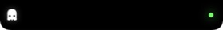
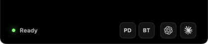
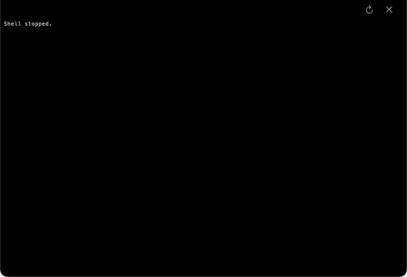
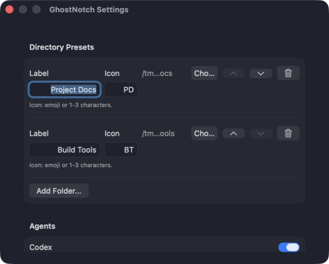

# GhostNotch v0.1.0 UI Polish Research Brief

Status: approved direction; Tracks 0–2 implemented
Reviewed: 2026-07-10
Primary audience: coding agents

## Purpose

GhostNotch should feel like a restrained macOS 26 utility with the fluidity of
an iOS Dynamic Island. [Alcove](https://tryalcove.com/) is the primary product
reference: expressive transitions, compact information, and quiet black
surfaces. GhostNotch must keep its own identity as a notch-attached terminal,
not become a general widget shelf or an imitation of another app.

This brief records the decisions agents must preserve during implementation.
The ordered work and acceptance gates live in
[UI Polish Sprint Tracking](ui-polish-sprint-tracking.md).

## Scope and non-goals

In scope, in priority order:

1. Collapsed, hover, and expanded notch shell.
2. Status presentation and quick-launch controls.
3. Expanded terminal header chrome.
4. Settings layout and control presentation.
5. Motion, accessibility variants, and measured rendering performance.

Out of scope:

- Terminal font, cell metrics, glyph rendering, PTY behavior, and terminal
  feature work.
- New activities, widgets, launchers, settings, gestures, or status meanings.
- Changes to the labels `Ready`, `Working`, and `Waiting`.
- A general-purpose design system or animation framework.
- Direct source reuse or a package dependency on Math Curve Loaders.
- Equal redesign effort for non-notch displays; fallback geometry only needs a
  regression pass.

## Verified current baseline

The baseline was inspected on macOS 26.4 with Xcode 26.4.1. Before source work,
the project declared `MACOSX_DEPLOYMENT_TARGET = 14.0`; Track 1 raised every
app and test configuration to macOS 26.0.

| Surface | Current implementation | Main polish issue |
| --- | --- | --- |
| Collapsed | `280 x 38` points on the measured 220-point notch; white Ghostty mark on the left and a 6-point status dot on the right | Status mark is too small for a curve loader; strong custom glow is less system-native |
| Hover | `420 x 90` points for a 38-point notch; 24-point side padding, 12-point bottom padding, 32-point controls | Custom button surfaces, rounded status typography, and independent view swapping lack a shared hierarchy |
| Expanded | `822.8 x 562` points; 38-point reserved header and 5-point terminal inset | Header actions have minimal feedback and appear separately from the shell transition |
| Settings | Native grouped `Form`, fixed 560-point width, manually sized preset fields | Native base is sound, but dense row composition and mixed fixed widths need a macOS 26 pass |
| Shell motion | AppKit frame animation: 0.18 seconds to expanded, 0.16 seconds otherwise, `easeInEaseOut` | One target-based curve does not coordinate shell, shape, content, or interrupted transitions |
| Status motion | Static green or a custom triangular breathing cycle driven by `TimelineView` | The dot language does not match the requested Rose Three loader and runs a separate custom visual vocabulary |

### Stored evidence









Evidence: sanitized baseline screenshots, standard and Reduce Motion H.264
transition clips at 48, 50, 60, and 120 Hz, and
[baseline performance](images/ui-polish/performance.md) — 2026-07-11,
Mac16,7. The temporary capture wiring was removed before performance sampling.

Numbered observations:

1. The physical camera housing correctly remains an uninterrupted black center;
   polish must extend it rather than place glass over it.
2. The side extensions have about 30 points each, so a 14-point status mark is
   the initial maximum to test without changing the collapsed width.
3. The current glow is visible at this scale, but the dot has no recognizable
   shape beyond color.
4. Settings evidence uses an isolated `UserDefaults` suite so no private local
   folder paths enter the repository.
5. Hover and expanded baselines were captured with temporary Debug-only state
   wiring that was removed before performance sampling.

## Research sources and conclusions

### Apple platform guidance

- [Designing for macOS](https://developer.apple.com/design/human-interface-guidelines/designing-for-macos/)
  favors familiar controls, keyboard support, precise pointer interaction, and
  smooth changes between active and inactive states.
- [Typography](https://developer.apple.com/design/human-interface-guidelines/typography)
  recommends system fonts, built-in styles, clear hierarchy, and avoiding light
  weights at small sizes. macOS has no Dynamic Type, so compact explicit sizing
  remains acceptable when documented.
- [Layout](https://developer.apple.com/design/human-interface-guidelines/layout)
  requires respect for display features and safe areas. GhostNotch's measured
  notch geometry remains the source of truth.
- [Materials](https://developer.apple.com/design/human-interface-guidelines/materials)
  places Liquid Glass in a functional control layer and warns against using it
  throughout the content layer. This supports an opaque black shell with glass
  reserved for important controls.
- [Motion](https://developer.apple.com/design/human-interface-guidelines/motion)
  says motion must communicate state rather than exist for decoration.
- [Accessibility](https://developer.apple.com/design/human-interface-guidelines/accessibility)
  requires sufficient control size and spacing, and alternatives for people
  who reduce motion or transparency.

Relevant macOS 26 APIs include SwiftUI `Spring`, `GlassEffectContainer`, glass
button styles, `accessibilityReduceMotion`, `accessibilityReduceTransparency`,
and `colorSchemeContrast`. Use them at their owning view boundary; do not add a
wrapper layer simply to hide these APIs.

### Product references

- [Alcove](https://tryalcove.com/): primary reference for quiet black surfaces,
  compact information, and fluid state changes.
- [Boring Notch](https://github.com/TheBoredTeam/boring.notch): open-source
  comparison for SwiftUI/AppKit notch composition and interaction breadth.
- [SuperIsland](https://dynamicisland.app/): comparison for iOS-like live
  activity density and compact controls.

Transfer only principles: physical attachment to the notch, restrained
information density, clear state hierarchy, and coordinated motion. Do not copy
assets, layout measurements, or product-specific animation choreography.

## Visual direction

### Typography

- Replace the hover status label's rounded custom face with the system default
  design and a semantic label/caption style.
- Prefer Regular or Medium for labels. Use Semibold only when hierarchy requires
  it; avoid light weights.
- Preserve the terminal grid typography unchanged.
- Use symbol fonts and semantic sizing for header actions. Do not hand-tune
  tracking.
- Keep explicit compact sizes only when a semantic style fails the fixed notch
  geometry, and record the exception beside the value.

### Spacing and dimensions

- Preserve collapsed and expanded shell dimensions. Track 2 raises the hover
  shell from 90 to 112 points so the group captions and native outer capsule
  remain below the physical notch without crowding.
- Use 40-by-32-point quick-launch targets with a two-point outer capsule inset;
  they exceed Apple's 20-point macOS minimum and read as compact pills rather
  than rounded squares. Keep native hover and press glass centered at 36 by 28
  points inside those targets so its material never spills beyond the group.
- Normalize internal gaps around a small set of local values instead of adding
  a global token system. Use zero points between actions inside a capsule, 4
  points from each caption to its capsule, 8 points between the status and
  first control group, and 12 points between the folder and agent capsules.
  Preserve the existing 24-point horizontal and 12-point bottom hover padding.
- Keep notch clearance calculations shared between rendered controls and
  `WindowPositioner`.
- Change an outer dimension only when a captured state proves clipping,
  overlap, or poor target separation. Document the evidence in the tracker.

### Color and material

- Keep the shell opaque black, including the area touching the hardware notch.
- Use semantic foreground styles for labels and symbols.
- Use system green for ready, white/primary for working, and system blue for
  waiting. Preserve these meanings.
- Reduce glow to a small state accent. Increase Contrast must strengthen the
  mark or outline without relying on glow.
- Give folders, agents, and expanded actions one persistent native
  `glassEffect(.regular.interactive(), in: Capsule())` surface per group. Keep
  inner actions plain at rest and materialize a centered 36-by-28-point native
  `glassEffect` subcapsule with a 14% white tint on pointer hover. Render the
  selected folder as one 40-by-32-point `NSColor.systemBlue` content layer
  mixed 18% toward white beneath the outer folder glass so native refraction
  can reach sibling folder segments without reaching the separate Agents
  capsule. Move it with a 0.18-second `snappy` spring and fade it in or out over
  0.12 seconds. Reduce Motion removes the translation and uses a 0.08-second
  fade; Reduce Transparency replaces the hidden backing with an exact-size
  native tinted glass segment using the same brighter blue. Do not apply glass
  to the black shell, terminal canvas, status mark, or Settings form.
- Let macOS own glass focus, hover, press, Reduce Transparency, and Increase
  Contrast rendering. Add no imitation glass fill, stroke, blur, or material.
  Activate the hover panel on pointer entry so macOS renders genuine focused
  glass, then restore the previously active app on pointer exit. Expansion keeps
  GhostNotch focused.
- Draw the black shell's faint rim with native `NSColor.separatorColor`, not a
  hand-tuned white opacity.

## Motion direction

The desired character is a restrained physical spring: fast, responsive, and
with little or no visible bounce. Motion covers shell, corner shape, rim,
content, selection, hover, press, and status changes. Settings does not gain
decorative motion.

### Transition storyboard

| Transition | Shell | Content | Interaction rule |
| --- | --- | --- | --- |
| Collapsed → hover | Width and height grow from the notch anchor; corner/rim settle with the shell | Status and controls fade/scale in after expansion begins | Open immediately on pointer entry |
| Hover → collapsed | Shell returns to physical-notch width | Controls fade before the last part of contraction | Start after a short exit grace; cancel if the pointer returns |
| Collapsed/hover → expanded | Shell grows from the same top-center anchor | Expanded header appears first; terminal surface becomes visible and focusable at settlement | Preserve `finishExpandPanelAnimation()` as the only focus/repaint completion seam |
| Expanded → collapsed | Terminal content fades/clips before contraction | Collapsed side marks appear near settlement | Preserve blur and session behavior |
| Interrupted transition | Retarget from the visible frame and content state | Never flash both complete layouts | Last requested state wins; stale completions do nothing |

Initial tuning bounds for the implementation sprint:

- Collapsed → hover: 0.18–0.24 seconds.
- Hover → collapsed: 0.16–0.22 seconds after a 0.10–0.16 second exit grace.
- Collapsed/hover → expanded: 0.24–0.32 seconds.
- Expanded → collapsed: 0.20–0.28 seconds.
- Minimal overshoot; no repeated oscillation.

These are tuning bounds, not constants. Record the chosen values with a 60 fps
and 120 Hz screen recording.

Start with these exact timings:

- Collapsed → hover: 0.22 seconds.
- Hover → collapsed: 0.18 seconds after a 0.12-second exit grace.
- Collapsed/hover → expanded: 0.28 seconds.
- Expanded → collapsed: 0.24 seconds.
- SwiftUI content: `snappy` spring with the matching duration and
  `extraBounce = 0.02`.
- Outgoing content fades during the first 35% of a transition. Incoming content
  begins at 25% and reaches full opacity at settlement.

Agents may move a duration only inside the bounds above. Every deviation must
be recorded beside the before/after recording and keep `extraBounce` between
0 and 0.05.

### Motion implementation decision rule

Start at the highest existing platform rung:

1. Keep `NSAnimationContext` for the panel frame, but give each transition its
   own timing and coordinate SwiftUI content with system springs.
2. Test rapid retargeting, focus settlement, and native-refresh pacing using
   the measurement protocol below.
3. Add one display-linked frame animator only if Instruments or recordings show
   that `NSAnimationContext` cannot meet the interruption or frame-pacing gates.

Do not maintain two production animation engines. Once the gate selects one,
remove the rejected path.

The existing engine passes only if three repeated runs meet all of these rules:

- Ten collapsed/hover round trips and five expand/collapse round trips complete
  without a stale completion, wrong final state, or focus failure.
- In each run, Core Animation/Instruments reports average active-transition FPS
  at least 95% of the display's active refresh rate and no hitch of 100 ms or
  longer. Do not average FPS across runs.
- No captured frame shows two complete state layouts at once.

If the first three-run set fails, inspect that evidence and allow one correction
cycle: one source revision limited to stale-completion/state invalidation and
timings within the bounds above, followed by one complete three-run retest. If
that retest fails any rule, use the display-linked driver. Do not keep tuning
the platform animator indefinitely.

### Accessibility variants

- Reduce Motion: move the panel directly to its target frame with no spring,
  scale, or overshoot. Cross-fade outgoing and incoming content over 0.08
  seconds with an ease-out curve; skip the fade if only one layout is present.
  Rose Three remains static.
- Reduce Transparency: opaque controls and settings surfaces.
- Increase Contrast: stronger semantic foreground/outline, not a larger glow.
- Motion and color never replace accessibility labels or the hover status text.

## Rose Three status specification

The requested mark is the three-petal rose family identified as `Rose Three` in
[Math Curve Loaders](https://github.com/Paidax01/math-curve-loaders). A later
[SwiftUI fork](https://github.com/adityadaniel/math-curve-loaders) exposes a
larger reusable package, but neither repository currently presents a license
file and the fork has no published release. GhostNotch must not copy or depend
on that source.

Implement a clean-room view from the public polar equation:

```text
r(θ) = a cos(3θ)
x(θ) = r(θ) cos θ
y(θ) = r(θ) sin θ
```

Required state mapping:

| Agent state | Color | Motion | Text in hover |
| --- | --- | --- | --- |
| Ready | System green | Static complete Rose Three | `Ready` |
| Working | White/primary | Particle trail following Rose Three | `Working` |
| Waiting | System blue | Same motion as working | `Waiting` |
| Any state + Reduce Motion | State color | Static complete Rose Three | Existing text |

Implementation constraints:

- Use a 14-point square in collapsed and hover states.
- Use one native SwiftUI `Canvas`/timeline view and no dependency.
- Start with a 1.25-point static ready stroke. For active states, draw a
  0.6-point guide at 12% opacity plus 18 trail particles with a 1.5-point
  maximum diameter, 0.34-cycle trail span, and 1.8-second loop.
- Do not create a timeline while ready or while Reduce Motion is enabled.
- Change those starting values only if a 1x or 2x capture shows merged pixels,
  an unrecognizable three-petal shape, or clipping. Record the final value and
  evidence in this brief.
- Preserve `TerminalAgentActivityState` and hook/state-file contracts unchanged.
- Provide an accessibility label that includes the state; color is not the only
  programmatic signal.
- Make the hover labels static `Ready`, `Working`, and `Waiting`; the Rose Three
  mark replaces the current animated trailing periods.

## Acceptance evidence required before implementation sign-off

- Sanitized before/after captures for collapsed, hover, expanded, and Settings.
- Record every shell transition, including rapid reversal, at the display's
  60 Hz and 120 Hz modes when the hardware offers them. Otherwise use every
  available mode up to the highest rate and mark 120 Hz unavailable.
- Instruments evidence for animation frame pacing and idle CPU behavior.
- Ready state produces no continuous loader timeline work.
- Manual checks with Reduce Motion, Reduce Transparency, and Increase Contrast.
- Built-in-notch acceptance plus a non-notch/fallback smoke check.
- Existing terminal focus, repaint, session persistence, launcher, and preset
  behavior remains unchanged.

### Performance measurement protocol

Use Instruments Core Animation and Time Profiler on the same build and display:

1. Close other developer builds of GhostNotch, wait five seconds, then sample
   the collapsed ready process for 60 seconds.
2. Repeat three times and record the median app CPU percentage as the ready
   baseline.
3. Repeat with the working loader and waiting loader for 60 seconds each; keep
   a separate three-run median for each state.
4. Compare each final state only with its matching Track 0 pre-polish median:
   final ready may add no more than 0.2 CPU percentage points over Track 0
   ready, final working no more than 2.0 points over Track 0 working, and final
   waiting no more than 2.0 points over Track 0 waiting.
5. Record the display's active refresh rate. If 120 Hz is unavailable, test the
   highest available rate and mark the 120 Hz row `not available on test
   hardware`; this does not block the sprint.

Store sanitized evidence under `docs/images/ui-polish/`:

- `baseline-{collapsed,hover,expanded,settings}.jpg`
- `final-{collapsed,hover,expanded,settings}.jpg`
- `{baseline|final}-transitions-{standard|reduce-motion}-{rate}hz.mp4`, H.264
  and under 20 MB each. Each standard clip is one uncut sequence containing
  collapsed → hover → collapsed, collapsed → expanded → collapsed, and rapid
  reversal at the named active display rate. Each Reduce Motion clip repeats
  that sequence with the accessibility setting enabled. Use `60hz` and
  `120hz` when available; otherwise use the measured integer rate, such as
  `75hz`.
- `{baseline|final}-accessibility-{reduce-transparency|increase-contrast}.jpg`,
  a sanitized hover-state capture with the named setting enabled
- `performance.md` containing hardware, display rate, build commit, three raw
  runs, medians, and Instruments trace locations

Tracker evidence entries use the form `Evidence: artifact link — date,
hardware, state/accessibility mode`.
